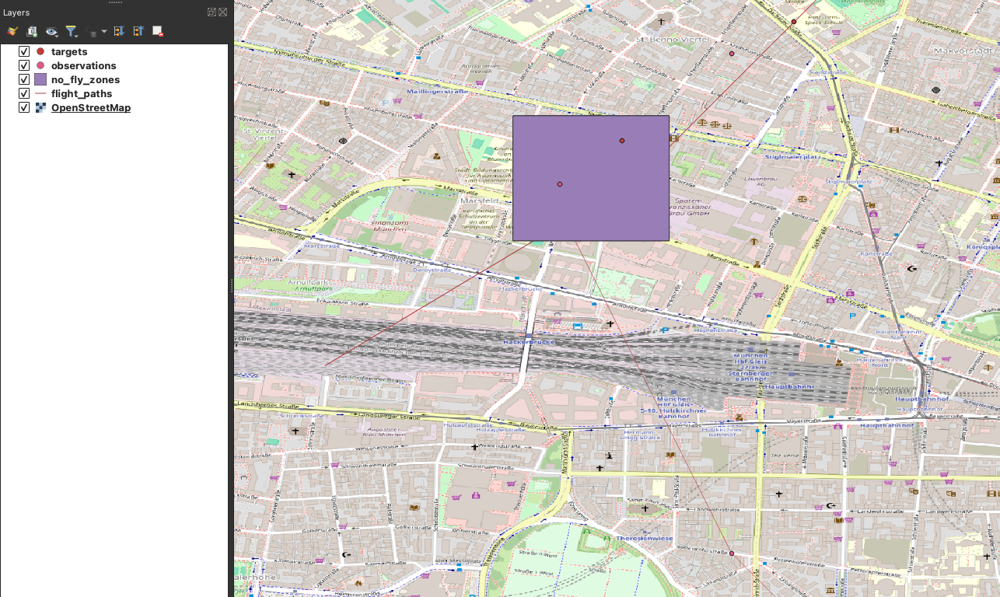
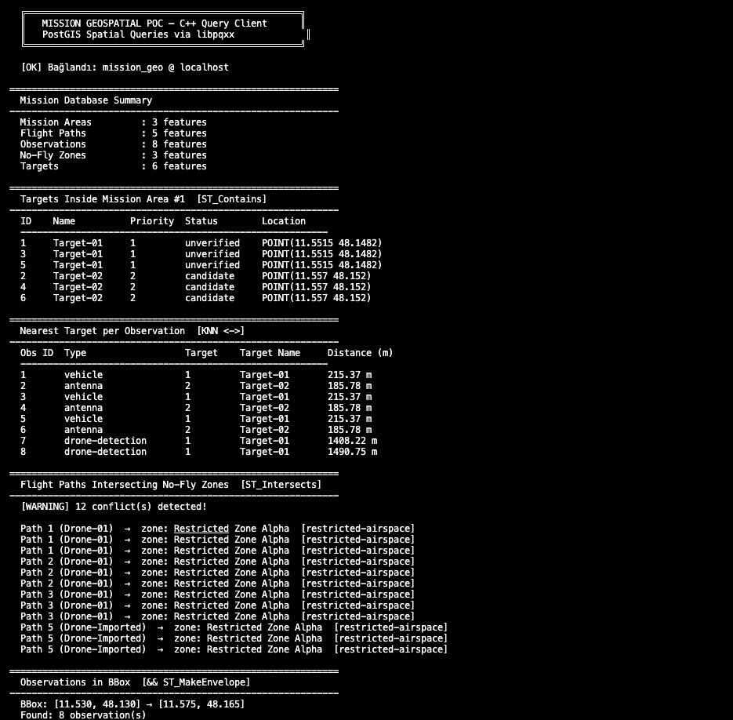
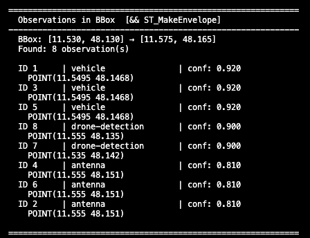

# Mission Geospatial PoC 

A lightweight, high-performance proof-of-concept for a geospatial backend inspired by real-world human-autonomy teaming (MUM-T) and mission support workflows. 

The project demonstrates how to build a robust spatial data architecture using Docker, PostgreSQL/PostGIS, Python-based ingestion pipelines, and a highly optimized C++ integration layer for real-time spatial queries.



## Core Features Delivered

- **Containerized Database:** Reproducible local geospatial stack with Docker (PostgreSQL 16 + PostGIS).
- **Data Ingestion Pipeline:** Python (GeoPandas) scripts to generate dummy drone flights and import external geodata into the database.
- **Coordinate Consistency:** Automated SRID normalization (EPSG:4326) and geometry validation.
- **C++ Autonomous Brain:** A modern C++17 client using `libpqxx` to execute millisecond-level spatial analyses:
  - `ST_Intersects`: Real-time collision checks against No-Fly Zones.
  - `<->` (KNN Indexing): Finding the nearest targets to drone observations.
  - `ST_Contains` & `&&` (BBox): Filtering operational objects within mission areas.

## Tech Stack

- **Infrastructure:** Docker Compose, PostgreSQL 16 + PostGIS
- **Data Pipeline:** Python 3, GeoPandas, Shapely
- **Query Engine:** C++17, libpqxx, CMake
- **Visualization:** QGIS / DBeaver

---

## Quick Start Guide

### 1. Start the Spatial Database
Run the PostgreSQL/PostGIS container in the background:

```bash
docker compose up -d
```
### 2. Run the Automated Data Pipeline
Execute the bash script to automatically set up the Python environment, generate dummy mission data, import it into PostGIS, and run spatial QA validations:
```bash
chmod +x run_pipeline.sh
./run_pipeline.sh
```

### 3. Build and Run the C++ Query Client (macOS / Apple Silicon)
Navigate to the `cpp` directory, build the project using CMake, and run the client:
```bash
cd cpp
# Create build directory if it doesn't exist, then enter and compile
mkdir -p build && cd build
cmake ..
make
./mission_client
```

### C++ Output Example
Below is the output of the C++ client performing high-speed spatial queries:




## Status
**Completed / Ready for Review.**